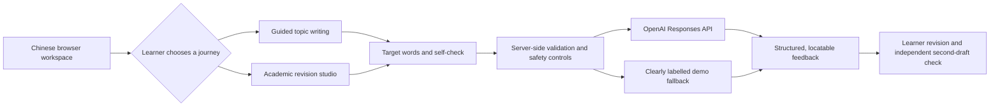

# ThinkRevise AI (Chinese)

ThinkRevise AI (Chinese) is an AI-guided academic English writing and revision agent for multilingual university students. It helps learners improve a draft while preserving ownership of the thinking and revision process.

This repository is the validated Chinese-interface candidate build for an educational AI course and portfolio. A separate English version will be produced only after the Chinese release gate is complete, changing user-visible language while preserving layout, workflow, data behaviour, safeguards, and AI logic.

## Current evidence

| Area | Current result |
| --- | --- |
| Product flows | Guided topic writing and academic-English revision both complete end to end |
| Assistance levels | Diagnose, local AI support, and direct rewrite remain behaviourally distinct |
| Accuracy harness | 36 reviewed cases containing 33 objective and 21 advisory gold issues |
| Revision integrity | Resolved, remaining, changed, and newly discovered second-draft issues are separated |
| Mobile | Both core journeys completed on a real phone after fixing an HTTP-context compatibility issue |
| Release automation | `npm run verify:release` passes without making paid API requests |
| Remaining release gate | Independent review of the academic-English gold set and public-deployment checks |

## Learning problem

Students can use generative AI to obtain polished English, but they may not understand what changed, why it changed, or how to transfer the principle to their next independent writing task. ThinkRevise AI therefore places a learner action before and after AI assistance.

## Product journeys

### Guided writing practice

- Select one of four curated topics or describe any custom direction in Chinese; live AI understands the theme only to supply related English target words. The learner is free to choose the article's viewpoint.
- Select a difficulty level.
- Receive 6, 8, or 10 topic- and level-filtered vocabulary items.
- Load a deliberately imperfect demo draft matched to the selected topic.
- Open definitions, collocations, and unrelated examples only when needed.
- See target words marked automatically as they are used in the draft.
- Write an 80–150 word response and complete a self-check.
- Receive a comprehensive set of reliably identifiable feedback items before revising.
- Let AI check whether the draft stays connected to the learner's chosen or described theme, without forcing a fixed writing question.

### Academic revision studio

Learners choose one of three support levels:

1. **Diagnose My Draft** — comprehensive diagnosis and red-marked locations, with no replacement sentences before the learner revises.
2. **Local AI Support** — the same diagnosis plus optional, expandable phrase- or sentence-level examples; the learner still revises the full draft.
3. **Rewrite for Me** — an immediate side-by-side original and complete academic rewrite, explicitly labelled as an editing mode with lower learning participation.

## Shared learning loop

`Set a goal → First draft → Self-check → Comprehensive AI diagnosis → Learner revision → Version comparison → Reflection → AI contribution record`

## System overview



## Safeguards and reliability

- Original drafts are never overwritten automatically.
- Learning modes require a self-check before AI feedback.
- Feedback covers all reliably identifiable language, academic-style, structure, and argument issues, up to the classroom-safe response limit.
- Local examples remain optional and are separated from the learner's editable draft.
- Prompts prohibit invented facts, data, authors, sources, and citations.
- Live AI calls use a server-only key and request `store: false`.
- Every AI route has a byte-level request-body ceiling, per-visitor rate and daily limits, a per-visitor concurrency lock, and global concurrency/daily request protection.
- Live AI calls have a classroom-safe timeout and automatically fall back to the labelled demo response.
- API responses send `Cache-Control: no-store`, and learner fields are treated as content rather than instructions.
- Input length is limited and the interface reminds learners to remove personal data.
- A fresh feedback request clears earlier hint and decision state so judgements cannot carry over accidentally.
- A clearly labelled demo-feedback mode keeps the peer trial usable without an API key or during an API outage.
- Active writing state is recoverable in same-tab `sessionStorage`; the project does not currently maintain an essay database.
- A public [privacy and AI-use notice](app/privacy/page.tsx) explains what is sent to the model, local recovery storage, provider retention boundaries and learner responsibilities.

## Technology

- Next.js 16 App Router
- React 19 and TypeScript
- Tailwind CSS 4 plus a custom responsive visual system
- OpenAI Responses API with JSON Schema structured output
- Deterministic classroom-demo fallback

## Run locally

```bash
npm install
cp .env.example .env.local
npm run dev
```

Open [http://localhost:3000](http://localhost:3000).

The application works in demo mode when `OPENAI_API_KEY` is empty. To test live feedback, each user must provide their own OpenAI API key in a local `.env.local` file or in their deployment provider's secret environment settings. Never commit that file, expose a key in browser code, or reuse the project owner's API credentials.

The default `gpt-5.4-mini` model and the Responses API structured-output configuration were checked against the [official OpenAI model documentation](https://developers.openai.com/api/docs/models/gpt-5.4-mini) and [Responses API reference](https://developers.openai.com/api/reference/cli/resources/responses/methods/create).

## Verification

```bash
npm run verify
```

The verification command includes request-size, concurrency, rate-limit, daily-budget and prompt-injection boundary tests. These checks do not call the paid API.

Before a release candidate, run the consolidated local gate and then complete the fixed manual checklist. The command starts an isolated forced-demo server for API and recovery tests, so it does not spend API credit:

```bash
npm run verify:release
```

With a local preview running, verify the request boundary and all three support modes with:

```bash
PROTOTYPE_URL=http://127.0.0.1:3000 npm run test:api
```

Live benchmarks are intentionally separate because they consume API credit. The local release gate never enables them silently.

## Quality evidence

- [Testing and iteration log](docs/TESTING_LOG.md)
- [Architecture and design rationale](docs/ARCHITECTURE.md)
- [Five-minute peer trial guide (Chinese)](docs/PEER_TRIAL_GUIDE_ZH.md)
- [Replaceable image guide](docs/IMAGE_GUIDE.md)
- [Chinese project roadmap and delivery checklist](docs/ROADMAP_ZH.md)
- [Security, privacy and deployment gate (Chinese)](docs/SECURITY_PRIVACY_ZH.md)
- [Chinese release checklist](docs/RELEASE_CHECKLIST_ZH.md)
- [Accuracy benchmark and scoring guide](benchmarks/accuracy/README_ZH.md)
- [Gold-set internal audit](benchmarks/accuracy/GOLD_AUDIT_ZH.md)
- [Consolidated 36-case live benchmark report](reports/accuracy/2026-09-07T19-44-49-189Z.md)
- [Latest dated local release result](docs/releases/2026-09-08-local-release-gate.md)
- [Remaining portfolio and release gaps](docs/PORTFOLIO_GAPS_ZH.md)

## Current status

- Chinese candidate build: automated release gate, real-phone core journeys, and three live-AI assistance-level checks passed
- Independent academic-English review: pending and still required before a stable-release claim
- English parity version: not started; begins only after the Chinese stable release
- GitHub publication and public deployment: not yet performed

## License

The original ThinkRevise AI source code and project documentation are available under the [MIT License](LICENSE). The license does not grant access to the project owner's OpenAI account, API key, credits, or other credentials. Users must configure and pay for their own API access when enabling live AI features.

Third-party packages, services, fonts, images, and other dependencies remain subject to their respective licenses and terms. The MIT License applies only to material in this repository that the copyright holder has the right to license. The project name and logo are not currently registered or separately licensed as trademarks.
